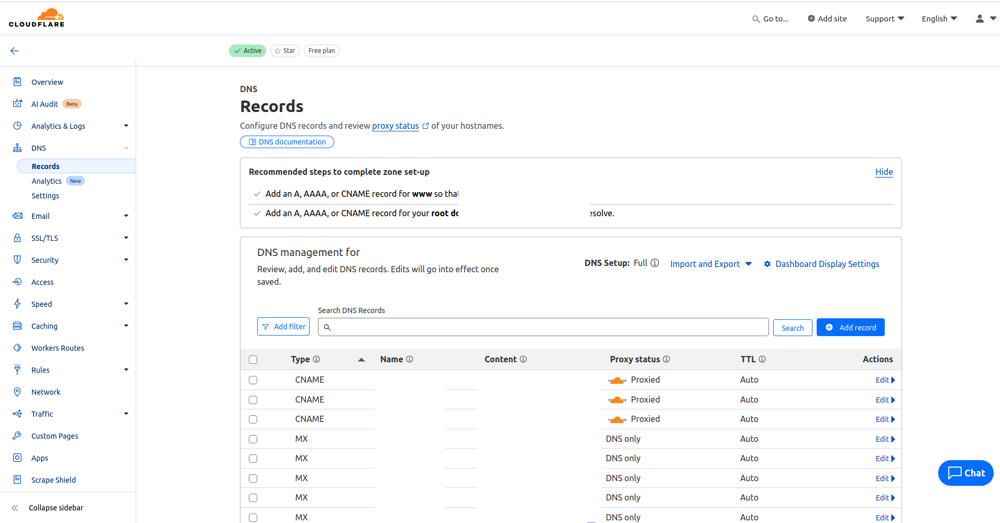

# Cloudflare Tunnel
Cloudflare Tunnel is a powerful tunneling solution designed to securely and efficiently route application traffic to your infrastructure. It helps you protect your web applications by encrypting traffic, hiding your web server IP addresses, and blocking direct attacks.

## Features
<p align="center">
  
</p>

- Hide Web Server IP Addresses
  - Mask the IP addresses of your web servers to add an extra layer of security and prevent direct access to your infrastructure.

- Block Direct Attacks
  - Automatically block attacks that target your web server, providing protection against malicious traffic.

- Simplify Application Delivery
  - Focus on delivering great applications while Cloudflare Tunnel handles the security aspects, ensuring safe and reliable communication with your infrastructure.

## Installation
Install cloudflare
### Ubuntu

#### With Terminal
```bash
sudo mkdir -p --mode=0755 /usr/share/keyrings
curl -fsSL https://pkg.cloudflare.com/cloudflare-main.gpg | sudo tee /usr/share/keyrings/cloudflare-main.gpg >/dev/null
echo "deb [signed-by=/usr/share/keyrings/cloudflare-main.gpg] https://pkg.cloudflare.com/cloudflared $(lsb_release -cs) main" | sudo tee /etc/apt/sources.list.d/cloudflared.list
sudo apt-get update && sudo apt-get install cloudflared

```

#### With .deb 
[Download Link](https://developers.cloudflare.com/cloudflare-one/connections/connect-networks/downloads/)

### Windows
Open window powershell with administrator acess and run the following:
```
winget install --id Cloudflare.cloudflared
```
## Usage
Before we start please allow port 80 and 443 and 7844 on ubuntu firewall with the following:
```
sudo ufw allow 80
sudo ufw allow 443
sudo ufw allow 7844
```

Also allow ports where you want to host your applications.
### 1. Authenticate Cloudflared
Open a terminal and run the following:
```bash
cloudflared tunnel login
```
You will be prompt to log in to your Cloudflare account. Select your hostname for the cloudflared API. A cert.pem will also be generated at the ~/.cloudflared directory (default cloudflared directory).

### 2. Create your tunnel
```bash
cloudflared tunnel create <NAME>
```
Running this will create a tunnel with the given name and provide you an UUID for the tunnel. **Please copy down the UUID**. An "UUID".json will be created at the ~/.cloudflared directory (default cloudflared directory). **If you lost the UUID**, it can be **retrieved again from the .json.**

### 3. Create config.yml
Run the following to create a config file for your tunnel:
``` bash
sudo nano ~/.cloudflared/config.yml
```

In the config.yml, add the following `CTRL + S then CTRL + X to save and exit the nano editor`:
```
tunnel: <YOUR TUNNEL NAME>
credentials:  /root/.cloudflared/<YOUR TUNNEL UUID>.json

ingress:
    -hostname: <WHERE DO YOU WANT TO HOST IT PUBLICLY>
     service: <WHERE IS YOUR THING HOSTED ON YOUR SERVER LOCALLY>

    -service: http_status:404
```

Your service should point towards the application that you want to expose, eg: You want to expose an API endpoint that is hosted on http://localhost:8080, your service should be http://localhost:8080. You can add multiple hostname+service pairs to serve multiple endpoints using the same tunnel (upto 1000 endpoints per tunnel).

Here is an example config.yml for your reference:
```
tunnel: myfirsttunnel
credentials: /root/.cloudflared/uuid.json

ingress:
    - hostname: api.honeydew.com
      service: http://localhost:8000

    - hostname: api-pineapple.honeydew.com
      service: http://localhost:4324

    - hostname: api-durian.honeydew.com
      service: http://localhost:80

    - service: http_status:404 #must be included at all times, it routes any invalid request to 404
```

### 4. Register Your Hostname on cloudflare dashboard
Navigate to "Your Domain > DNS ". You will see something like this:
<p align="center">
  
</p>

Click Add record with the following inputs:
| Parameter | Input     | Description                |
| :-------- | :------- | :------------------------- |
| `Type` | `CNAME`| Select A if you have static IP; dynamic IP select CNAME, `we have dynamic IP`|
| `Name` | `api.honeydew.com`| Proper URL where you want to host ur endpoint, only one level of SUBDOMAIN is allowed for free tier cloudflare.
|`Target`| `<YOUR API TUNNEL UUID>.cfargotunnel.com`| To point everything to CF argo tunnel which handles security for us

Add multiple record if you have other application to host.

### 5. Run the tunnel
Open a terminal and run:
```bash
cloudflared tunnel run <UUID or NAME>
```

## Tadaaa
You should be able to see your application at your desired hostname. Remember to turn off portforward on the ports that you previously hosted, else all effort wasted

## References

 - [CloudFlare Docs - Create Local Tunnel](https://developers.cloudflare.com/cloudflare-one/connections/connect-networks/get-started/create-local-tunnel/)
 - [CloudFlare Docs - Installation](https://developers.cloudflare.com/cloudflare-one/connections/connect-networks/downloads/)
